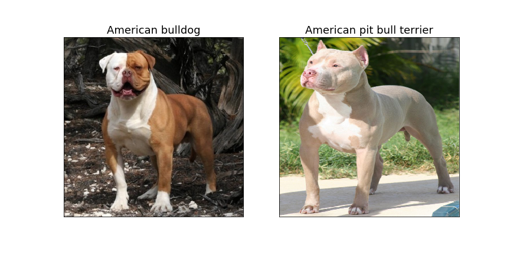

# Oxford-Pet-Project
## Fine-grained classification of cat and dog breeds using Oxford-IIIT Pet dataset
---
## Dataset description
Have you ever seen a cat or dog of an extraordinary breed on the street and immediately wanted to find out what its breed is? Well, now you can do that, all thanks to this project:)
The dataset can be found here: [The Oxford-IIIT Pet Dataset](http://www.robots.ox.ac.uk/~vgg/data/pets/)

### Short overview
The dataset consists of 25 dog breeds and 12 cat breeds, about 200 examples of each breed, so it comprises 7349 images in total. Some breeds are very distinct, others are quite similar for a human eye. Let's see what a deep neural network can do about this problem.

---
## Preprocessing and Data augmentation
There are several steps that are taken to prepare the dataset for futher processing and to increase the size of the dataset. They are:

1. reshape all images into shape (299, 299, 3)
2. flip every image horizontally (x2)
3. apply PCA color augmentation to all previous transformations (x4)

This results in a preprocessed dataset which is 4 times the dataset
I started with.  
To learn more about what functions are used for preprocessing and see it applied to an example image, check out this file: `data/oxford_pet/prepare_oxford_pet.py`

### Further data augmentation
While working on this project, I discovered that there are some *problematic*
pet breeds which are difficult for the model (as well as for a person) to
distinguish, and so I found some additional images of those breeds on the 
Internet (downloaded from *Google Images*), and added them to the train set with all required preprocessing. New images contain postfix *_new* in their name.

### Good news
I decided that since preprocessing *took a long time* to complete,
I would supply this project with the dataset that is already preprocessed
and augmented, so no further processing is required.

---
## Train/dev/test split
Taking into account the fact that dev and test set distributions
should be represantative of the whole dataset, and that the size of the 
original dataset is not so big (7349 images), I decided that dev and test
datasets should be 10% of the whole dataset each (that is 735 images each),
and of course splitting is stratified.

As soon as all preprocessing, which is described in *Preprocessing and Data augmentation* section above, takes place, respective
changes are made to the training set (which now contains ~ 34k images),
and then it is shuffled.

Images are placed in 3 different folders:
- `data/oxford_pet/train_images` (fully preprocessed)
- `data/oxford_pet/dev_images` (only resized)
- `data/oxford_pet/test_images` (only resized)

For your convenience (e.g., if your ever decide to change train/dev/test split),
`train_images` folder also contains augmented images from dev and test sets. Since this folder takes up ~5.4GB of disk space, I had to remove it from the project, but you can download it [here](https://drive.google.com/open?id=1nGGpNwF1o8XbAMINFcFTMXico9Pit5a1).

---
## Model structure
As the size of the original dataset is small, I decided to start my model with a network pretrained on some large dataset. I found ***[Xception](https://arxiv.org/abs/1610.02357)*** to be a rather good choice, since it showed impressive results on *ImageNet* dataset. I also decided to retrain the [Exit flow](https://towardsdatascience.com/review-xception-with-depthwise-separable-convolution-better-than-inception-v3-image-dc967dd42568) of Xception, which slightly increased the performance of my model (I would retrain even a bigger part of Xception, but my machine doesn't have enough GPU memory for this).

Here is the structure of the model I built:

- Xception network with retrained Exit flow
- Dense layer for predictions

As you see, the model is quite simple to build (thanks to *Keras* framework), but the results I get are quite astonishing given the complexity of the problem.

This model, trained for sufficient number of epochs, gives the following accuracy:

- *95.5%* on train set
- *95.4%* on dev set
- *94.8%* on test set

I should also mention that *data augmentation* increased dev set performance from *93.5%* by approximately *1%*, and retraining Exit flow of Xception resulted in futher *1%* improvement in accuracy.

As you see, my model does **not** have large **variance** problem, and that's great!  
Also, using more complex models does not improve the performance on dev set. This made me realise that there is **not** much of **avoidable bias** left, and that my model's error propably got pretty close to *Bayes error* for this problem. More on that in the next section...

Oh, and I didn't need an extra classifier to distinguish between cats and dogs, as this is done perfectly by the existing model.

---
## Error analysis
Can you see much difference between the following two breeds:

They look quite similar. In fact, American bulldog, American pit bull terrier and Staffordshire bull terrier are three most confused classes in this dataset among dogs.
For cats, the most similar breeds are Ragdoll and Birman. If you check out images of those breeds in the dataset, you'll notice that some of them are hard to distinguish even for a professional in this field. That's why, it's safe to say that **Bayes error** for this problem is probably about *4%* or more, and so the model I built achieves pretty good results.

---
## Final remark
If you want to learn more about the structure of the project and how to interact with it from shell, check out [DRU-DL-Project-Structure](https://github.com/dataroot/DRU-DL-Project-Structure) GitHub repository from *DataRoot University*.

